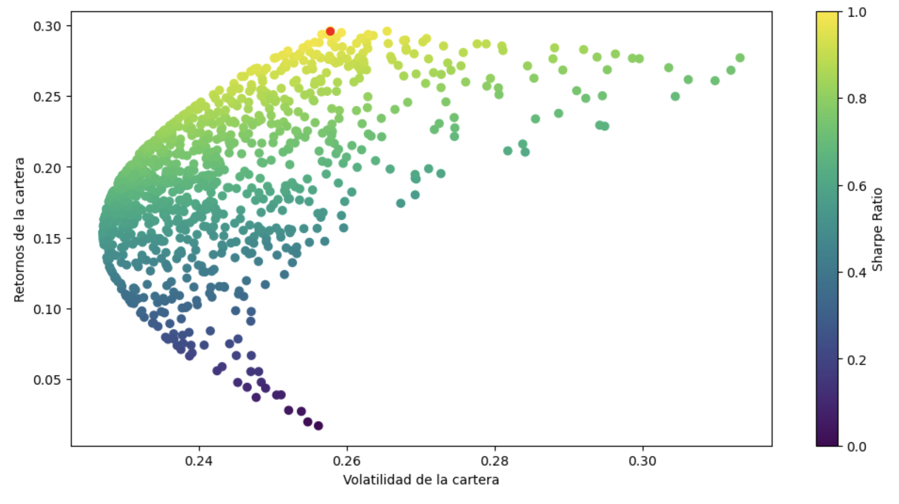

# Repositorio de Análisis Financiero con Python

Este repositorio contiene tres notebooks de Jupyter, cada uno dedicado a un aspecto único del análisis financiero utilizando Python. Estos notebooks ofrecen una visión práctica y detallada de las técnicas modernas de análisis de carteras de inversión y la gestión de riesgos financieros.

## Notebook 1: Análisis del Dow Jones con PCA

- **Objetivo**: Explorar la relación entre el método de Análisis de Componentes Principales (PCA) y el comportamiento del Índice Dow Jones.
- **Metodología**:
  - **Datos**: Utilización de la API de Yahoo Finance para obtener precios de cierre mensuales durante tres años de las empresas del Dow Jones.
  - **Herramientas**: Uso de `sklearn.decomposition` para implementar KernelPCA.
- **Resultados**: Identificación de los principales componentes que influyen en el desempeño del Dow Jones.

  

## Notebook 2: Optimización de Portafolio con el Modelo de Markowitz

- **Objetivo**: Aplicar el modelo de Markowitz para encontrar la combinación de activos que ofrece el mejor retorno ajustado por riesgo.
- **Metodología**:
  - **Datos**: Precios de cierre mensuales de cinco años de un portafolio de ejemplo (3 acciones) obtenidos a través de la API de Yahoo Finance.
  - **Pasos**:
    1. Estimación de Retornos Esperados.
    2. Estimación de la Matriz de Covarianza.
    3. Optimización de Portafolio usando el índice de Sharpe.
    4. Generación de 100,000 portafolios aleatorios para visualizar la frontera eficiente.
- **Resultados**: Identificación del portafolio óptimo en términos de retorno y riesgo.

## Notebook 3: Simulación de Portafolio y Cálculo de VaR con Montecarlo

- **Objetivo**: Evaluar rendimiento y riesgo de un portafolio de inversión utilizando simulaciones de Montecarlo y calcular el Valor en Riesgo (VaR).
- **Metodología**:
  - **Simulación de Portafolio**: Uso del método de Montecarlo y la descomposición de Cholesky para proyectar el desempeño del portafolio a un año.
  - **Cálculo de VaR**: Implementación tanto paramétrica como mediante simulaciones de Montecarlo para estimar las pérdidas potenciales bajo un nivel de confianza del 95% en un período de un año.
- **Resultados**: Análisis detallado del VaR y las implicaciones para la gestión de riesgos de la cartera.

## Cómo Utilizar Este Repositorio

Este repositorio está diseñado para ser interactivo y educativo. Se recomienda:

- Clonar el repositorio y ejecutar los notebooks en un entorno local con Jupyter.
- Leer los comentarios en cada notebook para entender los pasos y metodologías utilizadas.
- Experimentar con diferentes datos y parámetros para explorar variaciones en los resultados.
